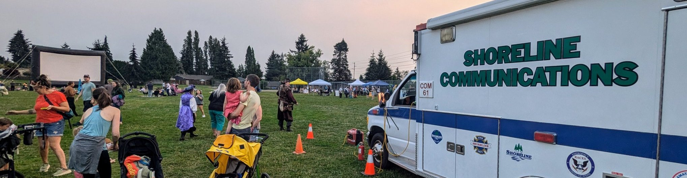
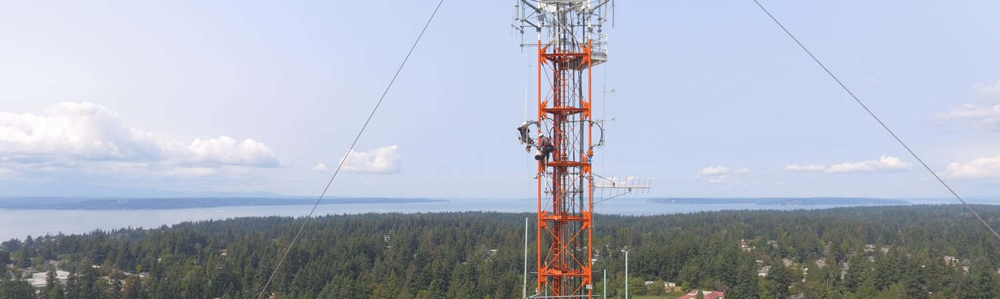

# Amateur Radio Team

[{ align=left }](/)
Shoreline Auxiliary Communications Service (Shoreline ACS) team was formed in 1995 and has maintained an active roster of volunteer licensed amateur (ham) radio operators since. We support the [City of Shoreline](http://www.shorelinewa.gov/services/emergency-services/emergency-management)'s Emergency Operations Center (EOC), Shoreline Police Department, and [Shoreline Fire Department](http://www.shorelinefire.com/). We regularly meet and train to ensure we are ready to provide emergency communications when needed. 

Visit our [About](/about/) page to learn more about us and find ways to [securely donate](/about/#donate).
 
 

---

## Monthly Meetings:
Visitors are always welcome at our monthly meeting, which takes place from 1000 – 1200 on the second Saturday of each month at the Shoreline Fire Department Headquarters Station, 17525 Aurora Ave N. (To avoid conflict with the Mike & Key Puyallup swap meet, our March meeting is usually on the third Saturday.)

## Weekly Net:
We have an on-the-air meeting – a net – each Monday evening on the Primary Shoreline repeater on 442.825 (+5 MHz, PL 103.5) at 1930 local time for the purpose of training, conducting team business and testing personal equipment. This net is typically an information type net and conducted in a formal manner. That means all check-ins, traffic and information is coordinated through the Net Control Station. There are times when you may have the opportunity to be Net Control. Although, as with most nets, we have a standard format and preamble to follow, these are not needed in order to conduct a successful session. Being Net Control is just that – you are in control of the net. Run the net in whatever way makes you comfortable. As long as you get all the stations checked in and handle any required announcements or requests for information, it is a successful net. It is important that all members have an opportunity to be Net Control for the Monday night net; it is good training for controlling a net during an emergency. More repeater and alternate contact information can be found on our [About](about.md) page.

Our Primary Repeater is located at ~285ft HAAT in Shoreline, WA. Learn more about our repeaters and other equipment on the [Equipment](/equipment/) page.

## Calendar of Events
<iframe src="https://calendar.google.com/calendar/embed?src=shorelineacs%40gmail.com&ctz=America%2FLos_Angeles" style="border: 0" width="1000" height="600" frameborder="0" scrolling="no"></iframe>

## Membership Requirements:
Training, licensing, and registration: Technician class or higher amateur radio operator’s license, FEMA [ICS-100](https://www.google.com/url?q=https%3A%2F%2Ftraining.fema.gov%2Fis%2Fcourseoverview.aspx%3Fcode%3DIS-100.b&sa=D&sntz=1&usg=AOvVaw3xaUrjwsJGxBEpFhSQnYo_) and NIMS [IS-700](https://www.google.com/url?q=https%3A%2F%2Ftraining.fema.gov%2Fis%2Fcourseoverview.aspx%3Fcode%3DIS-700.a&sa=D&sntz=1&usg=AOvVaw035knpZ5rEpGTTpSrgQ-7w) courses, registered Emergency Worker with the City of Shoreline and State of Washington, and criminal background checks as required by Shoreline Fire and Police Departments. The [ICS-200](https://www.google.com/url?q=https%3A%2F%2Ftraining.fema.gov%2Fis%2Fcourseoverview.aspx%3Fcode%3DIS-200.b&sa=D&sntz=1&usg=AOvVaw0LfUU3t1t82bdVomy-k7Vk) course is recommended.

Please contact Victoria at the  City of Shoreline Emergency Management Office to get an application and other necessary forms.  Victoria can be reached either by email at valie@shorelinewa.gov or by phone at 206 801-2254

---

{ width=300px; align=left }
{ width=300pxl; align=right }