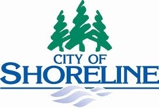

# Amateur Radio Team

[{ align=left }](/)
The Shoreline Auxiliary Communications Service team was formed in 1995 to support Fire District 4 and the [Shoreline Fire Department](http://www.shorelinefire.com/). We have since grown in size and in responsibilities: We now support the City of Shoreline’s [Emergency Operations Center](http://www.shorelinewa.gov/services/emergency-services/emergency-management) and the [Shoreline Police Department](https://www.shorelinewa.gov/government/departments/police-department/contact-shoreline-police), in addition to the Fire Department. Our team, consisting of about 35 volunteer amateur radio operators, trains to provide emergency communications in the event of disasters, since normal communication methods can quickly become overloaded during such an event, if they survive at all. We meet and train to ensure we are ready to provide emergency communications when needed. Visit our [About](/about/) page to learn more about us and find ways to [securely donate](/about/#donate) which helps us greatly with our cause.
 
 

---

## Events
### Monthly Meetings
Visitors are always welcome at our monthly meeting, which take place from 1000 – 1200 on the second Saturday of each month at the [Shoreline Fire Department Headquarters Station, 17525 Aurora Ave N.](https://maps.app.goo.gl/LajvESeHVgM6A7zE6) (Our March meeting is usually on the third Saturday to avoid conflict with the Mike & Key Puyallup swap meet.)

### Weekly Net
We have a weekly net every Monday evening at 1930. Learn more on our [Weekly Net](/weekly_net) page.

### Calendar of Events
Shoreline ACS attends most Shoreline Events. Stop by, we would love to say hello. Here is our full calendar of events. 
<iframe src="https://calendar.google.com/calendar/embed?src=shorelineacs%40gmail.com&ctz=America%2FLos_Angeles" style="border: 0" width="1000" height="600" frameborder="0" scrolling="no"></iframe>

---

[{ width=300px; align=left }](http://www.shorelinewa.gov/services/emergency-services/emergency-management)
[{ width=300pxl; align=right }](http://www.shorelinefire.com/)